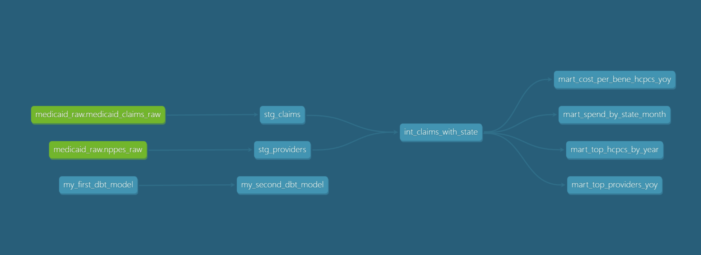

# Medicaid Provider Spending Analytics

End-to-end analytics pipeline transforming the HHS Medicaid Provider Spending dataset (227M rows, 2018-2024) into an interactive dashboard for cost-trend analysis. Built to demonstrate analytics engineering practices on real-world public-payer claims data.

## Architecture



- **Ingest:** Python loaders chunk-stream Parquet/CSV via `COPY` into a local Postgres database (~30 min for the full Medicaid file).
- **Transformation:** dbt Core models clean, join, and aggregate. Layered pattern: staging (renames, casts), intermediate (joins claims to NPPES for state lookup), marts (dashboard-ready aggregates).
- **Quality:** dbt tests on key columns (`not_null`, `unique`, `accepted_values`); methodological caveats documented inline.
- **Presentation:** Streamlit dashboard with five views — spend over time, geographic distribution, top providers YOY, HCPCS prevalence, cost-per-beneficiary trends.

## Data caveats (read this first)

The HHS Medicaid Provider Spending dataset has important scope limitations:

- **Outpatient and professional claims only.** Excludes inpatient hospital stays (DRG-coded), long-term care, and pharmacy.
- **State derived from billing NPI's NPPES address.** A provider's registered state is an approximation — multi-state systems and out-of-state providers introduce some attribution error.
- **Cell suppression:** rows with fewer than 12 total claims per provider-HCPCS-month are dropped from the source, so very low-volume relationships are absent.
- **Negative paid amounts** appear in the raw data due to claim adjustments and reversals. Trend metrics (CAGR, % change) are nulled for state-HCPCS-years with non-positive values.

## Findings

- **The total paid amount nationally YOY for Medicaid outpatient and professional spend decreased ~6.8% from 2023-24. This is the first time there was a decrease in spend over the last 5 years.**
- **CA, NY and TX had the highest total paid amount in 2024. AK, MO, NH had the highest cost per beneficiary in 2024.**
- **In 2024; the states of NY and CA had 5 out of 10 highest paid NPIs accross the dataset**
- **In the state of GA for 2024, Scottish Rite Children's Hospital ranked first in total paid amount at $72M, and has ranked in the top 2 organizations by total paid since 2018** 


## Project structure
```
medicaid-analytics/
├── ingest/                      # Python loaders (one-time setup)
│   ├── load_medicaid.py         # HHS Parquet → Postgres
│   └── load_nppes.py            # NPPES CSV → Postgres
├── medicaid_dbt/                # dbt project
│   ├── dbt_project.yml
│   ├── models/
│   │   ├── staging/             # cleaned source tables (views)
│   │   ├── intermediate/        # joined claim+state (view)
│   │   └── marts/               # dashboard inputs (tables)
│   └── macros/
│       └── generate_schema_name.sql
├── dashboard/                   # Streamlit app
├── requirements.txt
└── README.md
```
## Tech stack

- **Database:** PostgreSQL 16 (local)
- **Transformation:** dbt Core 1.10 with `dbt-postgres` adapter
- **Ingestion:** Python 3.12, pandas, pyarrow, psycopg2
- **Dashboard:** Streamlit, Plotly
- **Sources:** [HHS Medicaid Provider Spending](https://opendata.hhs.gov/datasets/medicaid-provider-spending), [NPPES Provider Registry](https://download.cms.gov/nppes/NPI_Files.html)

## Setup

### Prerequisites
- Python 3.12
- PostgreSQL 16+ running locally
- ~10 GB disk space for raw + transformed data

### Install
```bash
git clone <repo>
cd medicaid-analytics
python -m venv .venv
source .venv/bin/activate         # or .venv\Scripts\Activate.ps1 on Windows
pip install -r requirements.txt
```


